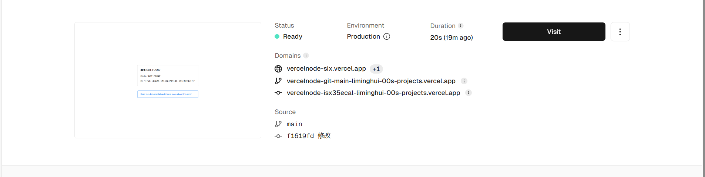
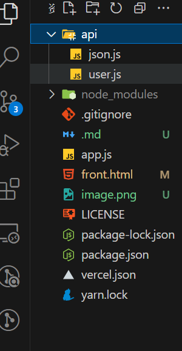

我：在 node 项目下，如果要配置 vercel.json 这个文件，前提需不需要 yarn add vercel

gpt:不需要在你的项目中使用 `yarn add vercel` 来安装 Vercel 作为一个依赖。`vercel.json` 是 Vercel 平台用来配置部署选项的文件，它并不需要 Vercel 包在项目中被安装。你只需创建 `vercel.json` 文件并将其放在项目的根目录下，然后在该文件中定义你的配置选项。
如果你需要在本地测试 Vercel 的部署配置或者使用 Vercel 的命令行工具（CLI）来管理部署，那么可以全局安装 Vercel CLI。可以使用以下命令来全局安装：

```bash
npm install -g vercel
# 或者
yarn global add vercel
```

安装后，你可以通过命令行使用 `vercel` 命令来部署项目，或者用 `vercel dev` 来在本地模拟 Vercel 的云环境。但记住，这是用于开发和管理部署的工具，与 `vercel.json` 文件的存在无直接关联。

我：
{
"headers": [{
"source": "/(._)",
"headers" : [
{
"key" : "Access-Control-Allow-Origin",
"value" : "_"
},
{
"key" : "Access-Control-Allow-Headers",
"value" : "content-type"
},
{
"key" : "Access-Control-Allow-Methods",
"value" : "DELETE,PUT,POST,GET,OPTIONS"
}
]
}],
"rewrites": [
{
"source": "/", // 重定向配置 访问/根路径重定向到/api/query-all-users
"destination": "/api/query-all-users"
}
]
}上面是 vercel.json 文件的内容，创建接口，vercel 约定在 api 下创建接口路径，最后我们可以通过域名/api/json 域名/api/query-all-users 来访问接口服务，我们这里创建了两个接口//api/json.js
// req 接收所有请求信息，res 是响应信息
// 通过 module.exports 暴露出去
module.exports = (req, res) => {
res.send('test')
}这是什么意思，目录结构是怎么样的，node 编写的接口是怎么样的

gpt:
在你提供的情况中，你使用 `vercel.json` 文件来配置你的 Node.js 项目的部署和路由行为。这里的配置内容和结构说明如下：

1. **headers** - 这部分的配置是为了设置 CORS (跨源资源共享) 相关的响应头。你配置了所有路径 (`/(.*)`) 对于所有请求类型，允许任何源 (`Access-Control-Allow-Origin: *`) 访问，并定义了允许的 HTTP 方法和允许的请求头（`content-type`）。

2. **rewrites** - 这部分的配置是为了将根目录 `/` 的访问重定向到 `/api/query-all-users`。这意味着，当用户访问你的网站的根路径时，他们会被自动重定向到这个 API 端点。

关于你提到的 Node.js 接口部分，你的项目目录结构可能看起来是这样的：

```
/你的项目目录
|-- api
|   |-- json.js
|   |-- query-all-users.js
|-- vercel.json
```

在 `api` 文件夹下，每个文件对应一个 API 端点。每个文件都应该导出一个处理函数，这个函数接收 `req` (请求对象) 和 `res` (响应对象) 参数。这种方式使得每个文件都成为一个独立的服务器端函数，可以直接响应特定的 HTTP 请求。

例如，`json.js` 文件中的内容如下：

```javascript
module.exports = (req, res) => {
  res.send("test")
}
```

这段代码定义了一个简单的 HTTP 接口，当访问 `/api/json` 时，它会返回文本 `test`。这里 `res.send` 是 Express.js 框架中用来发送响应到客户端的方法。

因此，当你在 Vercel 上部署这个项目时，你可以通过如下 URL 访问这些接口：

- `https://你的域名/api/json` - 会响应 `test`
- `https://你的域名/api/query-all-users` - 会根据你在 `query-all-users.js` 文件中定义的逻辑来响应请求

这样的结构使得部署和管理 Node.js 服务变得非常灵活和简便。

我：
我怎么查看自己的域名，还有一个图片是我 node 的目录结构，你看看这样对不对

gpt:从你提供的截图和信息来看，你的项目已经成功部署在 Vercel 上，而且你的域名也已经在截图中显示了。你可以使用如下的域名访问你的项目：

1. `https://vercelnode-six.vercel.app`
2. `https://vercelnode-git-main-limnghui-00s-projects.vercel.app`
3. `https://vercelnode-isx35cecal-limnghui-00s-projects.vercel.app`

关于你的项目的 Node.js 目录结构和代码，从你的第二个截图来看，你已经正确设置了一个基本的 Node.js 应用，其中包含以下文件和文件夹：

- `api/` - 存放 API 相关的 JavaScript 文件。
- `node_modules/` - 包含所有 Node.js 项目依赖。
- `.gitignore` - 用来指定 git 忽略跟踪的文件和文件夹。
- `app.js` - 主要的应用文件，定义了服务器和 API 路由。
- `package.json` - 描述项目的依赖和配置信息。
- `vercel.json` - 用于配置 Vercel 部署选项。
- `yarn.lock` - 锁定安装的依赖版本，确保一致性。

在 `app.js` 文件中，你定义了一个 API 端点 `/getuserinfo`，该端点执行 SQL 查询来获取用户信息。如果查询成功，它返回一个 JSON 对象，包括状态和数据；如果查询失败，它返回一个错误状态和错误信息。

你的项目结构和配置看起来是正确的。如果你在访问特定端点时遇到问题，例如访问 `/api/json` 或 `/api/getuserinfo`，确保你的 API 文件和路由设置正确无误。在 Vercel 上，每一个位于 `api/` 目录下的 `.js` 文件都被视为一个无服务器函数，可直接通过 `/api/[文件名]` 的形式访问。如果出现错误或无法访问的情况，查看 Vercel 的 Logs 选项卡，那里会有详细的错误信息和日志帮助你诊断问题。

链接：https://segmentfault.com/a/1190000041223777#item-4
